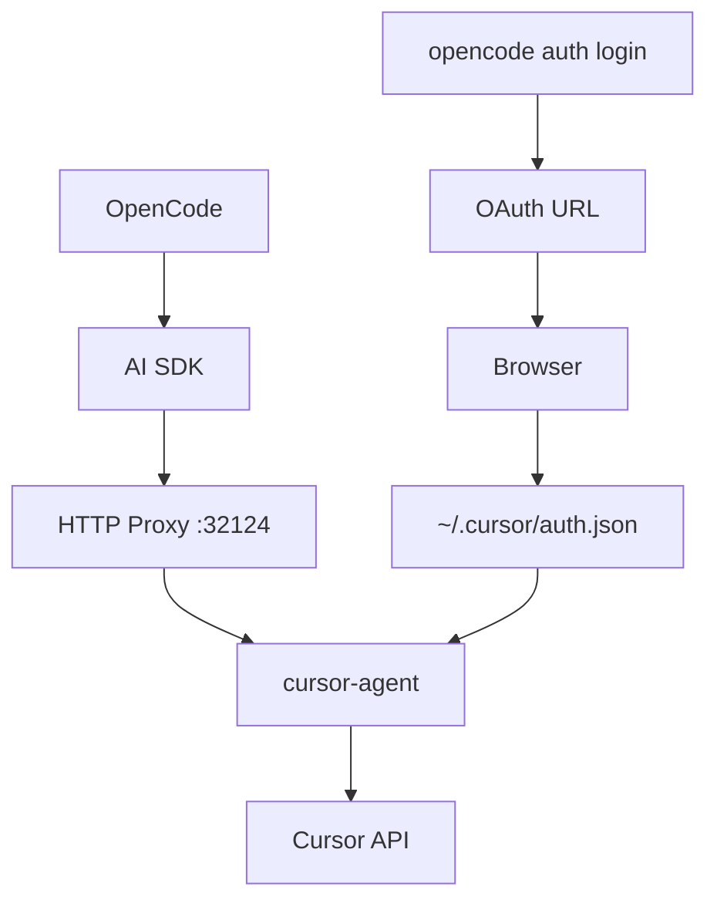

Use your Cursor Pro subscription in [OpenCode](https://github.com/anomalyco/opencode). HTTP proxy to cursor-agent with OAuth support.

## Installation

**One-Line Install:**

```bash
curl -fsSL https://raw.githubusercontent.com/Nomadcxx/opencode-cursor/main/install.sh | bash
```

**TUI Installer:**

```bash
git clone https://github.com/Nomadcxx/opencode-cursor.git
cd opencode-cursor
./cmd/installer/installer-binary
```

**Manual Install:**

```bash
bun install && bun run build
ln -s $(pwd)/dist/index.js ~/.config/opencode/plugin/cursor-acp.js
```

Add to `~/.config/opencode/opencode.json`:

```json
{
  "plugin": ["cursor-acp"],
  "provider": {
    "cursor-acp": {
      "name": "Cursor",
      "npm": "@ai-sdk/openai-compatible",
      "options": { "baseURL": "http://127.0.0.1:32124/v1" },
      "models": {
        "auto": { "name": "Auto" },
        "sonnet-4.5": { "name": "Claude 4.5 Sonnet" },
        "opus-4.5": { "name": "Claude 4.5 Opus" },
        "gpt-5.2": { "name": "GPT-5.2" },
        "gemini-3-pro": { "name": "Gemini 3 Pro" },
        "grok-4": { "name": "Grok 4" }
      }
    }
  }
}
```

> **Note:** The TUI installer adds all available models. See `cursor-agent --list-models` for the full list.

## Authentication

### Option 1: Via OpenCode (Recommended)

```bash
opencode auth login
```

Then follow the prompts:
1. Select **"Other"** from the provider list
2. Enter provider id: **cursor-acp**
3. Browser will open automatically - click "Continue with Cursor"
4. Return to terminal when you see "Login successful"

### Option 2: Direct (CLI only)

```bash
cursor-agent login
```

Then open the URL shown in your browser and complete authentication.

## Usage

```bash
opencode run "your prompt" --model cursor-acp/auto
opencode run "your prompt" --model cursor-acp/sonnet-4.5
```

## Models

Models are discovered dynamically from `cursor-agent --list-models`. The installer and sync script automatically populate your config.

**Sync models manually:**
```bash
./scripts/sync-models.sh
```

**API endpoint** (when proxy is running):
```bash
curl http://127.0.0.1:32124/v1/models
```

Common models include: `auto`, `sonnet-4.5`, `opus-4.5`, `gpt-5.2`, `gemini-3-pro`, `grok`, `composer-1`

## Architecture



## Alternatives

| | cursor-acp | [yet-another-opencode-cursor-auth](https://github.com/Yukaii/yet-another-opencode-cursor-auth) | [opencode-cursor-auth](https://github.com/POSO-PocketSolutions/opencode-cursor-auth) | [cursor-opencode-auth](https://github.com/R44VC0RP/cursor-opencode-auth) |
|---|:---:|:---:|:---:|:---:|
| **Architecture** | HTTP proxy via cursor-agent | Direct Connect-RPC | HTTP proxy via cursor-agent | Direct Connect-RPC/protobuf |
| **Platform** | Linux, macOS | Linux, macOS | Linux, macOS | macOS only (Keychain) |
| **Max Prompt** | Unlimited (HTTP body) | Unknown | ~128KB (ARG_MAX) | Unknown |
| **Streaming** | ✓ SSE | ✓ SSE | Undocumented | ✓ |
| **Error Parsing** | ✓ (quota/auth/model) | ✗ | ✗ | Debug logging |
| **Installer** | ✓ TUI + one-liner | ✗ | ✗ | ✗ |
| **OAuth Flow** | ✓ OpenCode integration | ✓ Native | Browser login | Keychain |
| **Tool Calling** | Via cursor-agent | ✓ Native | ✓ Experimental | ✗ |
| **Stability** | Stable (uses official CLI) | Experimental | Stable | Experimental |
| **Dependencies** | bun, cursor-agent | npm | bun, cursor-agent | Node.js 18+ |
| **Port** | 32124 | 18741 | 32123 | 4141 |

**Key advantages of cursor-acp:**
- Avoids E2BIG errors with large prompts (uses HTTP body, not CLI args)
- Structured error parsing with actionable suggestions
- Cross-platform (not locked to macOS Keychain)
- TUI installer for easy setup
- Uses official cursor-agent CLI (more stable than reverse-engineering Connect-RPC)

## Prerequisites

- [Bun](https://bun.sh/)
- [cursor-agent](https://cursor.com/) - `curl -fsSL https://cursor.com/install | bash`

## Features

- HTTP proxy (avoids E2BIG errors)
- Streaming responses
- OAuth authentication
- Error parsing (quota/auth/network)

## Troubleshooting

**"fetch() URL is invalid"** - Run `opencode auth login` without arguments

**Model not responding** - Run `cursor-agent login` to re-authenticate

**Quota exceeded** - Check [cursor.com/settings](https://cursor.com/settings)

## License

BSD-3-Clause
